# Mac Forensics with Apple File System (APFS)
---
## Table of content

- [Mac Forensics with Apple File System (APFS)](#mac-forensics-with-apple-file-system-apfs)
    - [Table of content](#table-of-content)
    - [Changelog](#changelog)
    - [Introduction](#introduction)
    - [APFS notable features](#apfs-notable-features)
        - [1. TRIM command](#1-trim-command)
        - [2. Encryption](#2-encryption)
    - [Acquisiton](#acquisiton)
        - [1. Static acquisition](#1-static-acquisition)
        - [1.1 Booting into MacQuisition](#11-booting-into-macquisition)
        - [1.2 Entering Case Info](#12-entering-case-info)
        - [1.3 Acquiring a non-FileVault encrypted drive](#13-acquiring-a-non-filevault-encrypted-drive)
        - [1.4 Acquiring a FileVault encrypted drive](#14-acquiring-a-filevault-encrypted-drive)
        - [1.4.1 Decrypting the drive](#141-decrypting-the-drive)
        - [1.5 Data collection](#15-data-collection)
        - [1.6 Image device](#16-image-device)
        - [1.6.1 Drive selection](#161-drive-selection)
        - [1.6.2 Image formats and settings](#162-image-formats-and-settings)
        - [2. Live acquistion](#2-live-acquistion)
    - [Analysis](#analysis)
        - [1. System Information](#1-system-information)
        - [2. fsevents log](#2-fsevents-log)
        - [2.1 Useful grep searches for fsevent analysis](#21-useful-grep-searches-for-fsevent-analysis)
        - [3. bash history and other shell history](#3-bash-history-and-other-shell-history)
        - [4. iMessage](#4-imessage)
        - [5. Outlook (Require DMG and Mac)](#5-outlook-require-dmg-and-mac)
        - [6. Apple System Log (ASL)](#6-apple-system-log-asl)
        - [7. Browser history](#7-browser-history)
        - [7.1 Safari](#71-safari)
        - [7.2 Chrome](#72-chrome)
        - [7.3 Firefox](#73-firefox)
        - [8. Installation log](#8-installation-log)
        - [9. SSH host file](#9-ssh-host-file)

---

## Introduction

Apple Files System (APFS) was introduced with macOS High Sierrea (iOS 10.3 and later), APFS is the properitay file system to replace HFS+ (MacOS Extneded). APFS is optimised for SSD storage with a primary focus on encrytion.

---

## APFS notable features

### 1. TRIM command

APFS uses TRIM command. TRIM command allows an the OS to inform the SSD which blocks of data are no longer considered in use and will be wiped internally.

SSD drives implement Deterministic Read After Trim (DRAT) or Deterministic Zeroes After Trim (DZAT). DZAT returns all-zeroes immediately after the TRIM command released a certain data block, while DRAT will return the original data until it’s physically erased with the garbage collection algorithm. These 2 options have a strong influence on the data recovery probablility.

### 2.  Encryption

APFS suppers full disk encryptions natively and encrypts your data at the file system level if FileVault 2 is turned on.  For this reason, “unlocking” APFS volumes does not result in a special block device that can be read to acquire an unencrypted version of an APFS volume.  As such, analysis tools such as BlackLight is required to decrypt APFS file system metadata and data blocks on demand.

---

## Acquisiton

This section details the process to acquire a Mac with Macqusition, including live systems.

### 1. Static acquisition

### 1.1 Booting into MacQuisition

To enter the boot menu of a Mac, hold on to option after pressing the power button. The boot manager should display shortly. Select **MacQuisition 2018R1.2.**

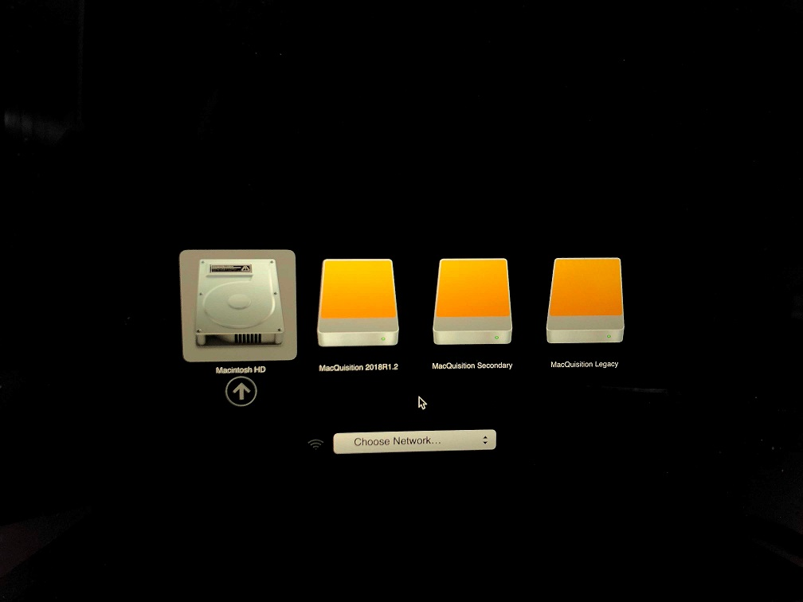

Should the Abnormal Shutdown notification shows up, select New Database

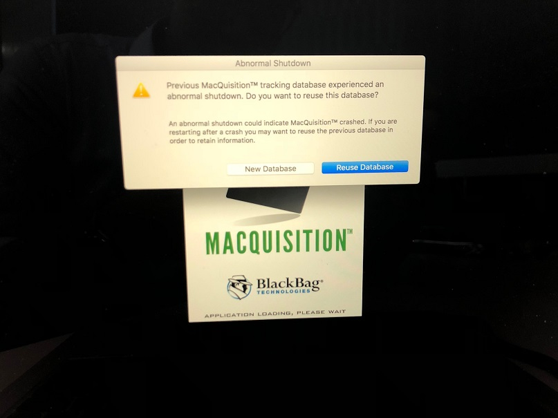

### 1.2 Entering Case Info

Case details tab will be shown after the system is booted up. Enter case information as per usual.


Pay attention to the date tab as it does not defualt to GMT +8.

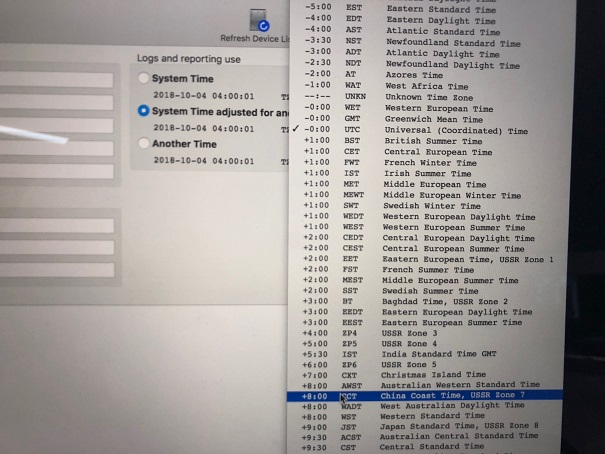

### 1.3 Acquiring a non-FileVault encrypted drive

If a drive is not FileVault encrypted, the content of the exhibit should be visible under the Data Collection tab. 


Additionally, Image Device tab will not show the APFS container as encrypted.

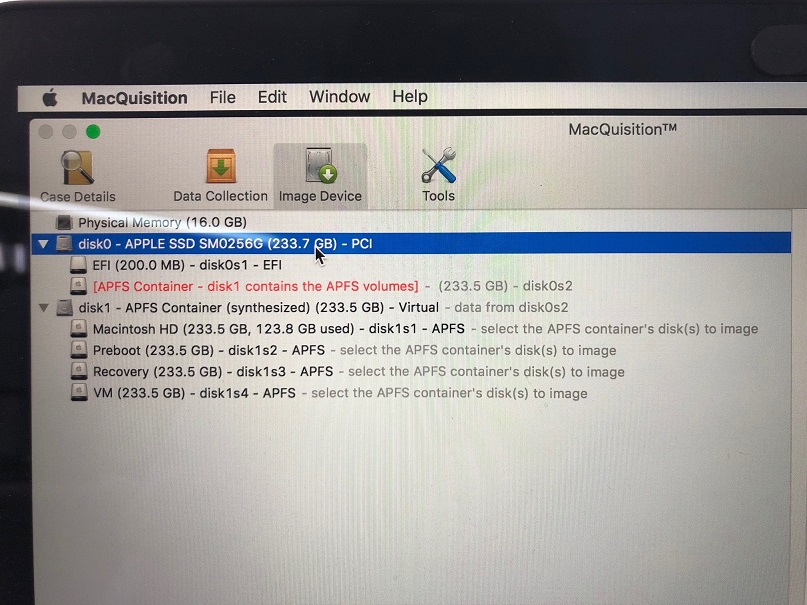

### 1.4 Acquiring a FileVault encrypted drive

A FileVault 2 encrypted device will not display data under the Data Collection tab.

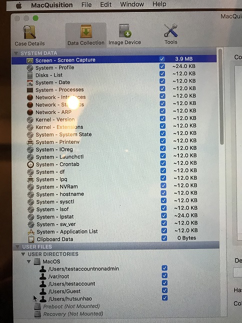


### 1.4.1 Decrypting the drive

To decrypt the drive, select Tools tab and click on the encrpyted drive. Enter either the password or recovery key will unlock the drive.

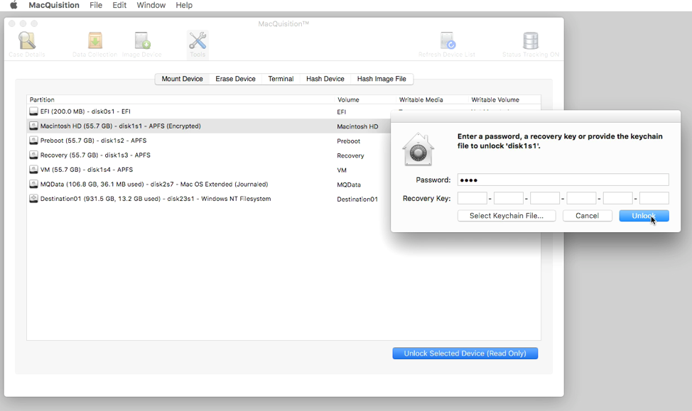

The APFS container will display as encrpyted (unlocked) under the Image Device tab after successful decryption.

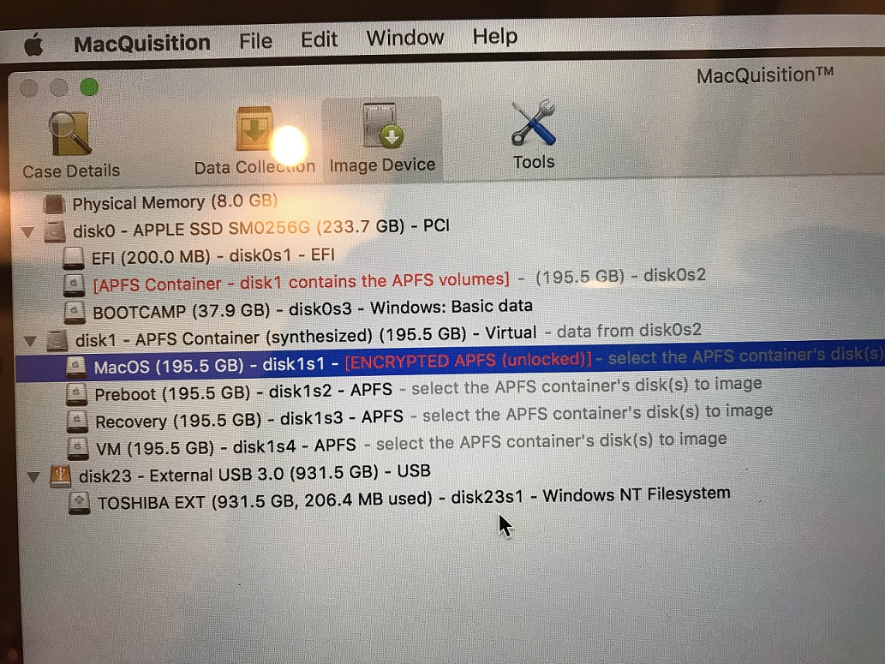

### 1.5 Data collection

**Data Collection is only available to non FileVault 2 encrypted drives.  Drives with FileVault 2 turned on will not display drive contents even after unlocking the drive.**

Select the items of interest and begin the acquisiton.

### 1.6 Image device

### 1.6.1 Drive selection

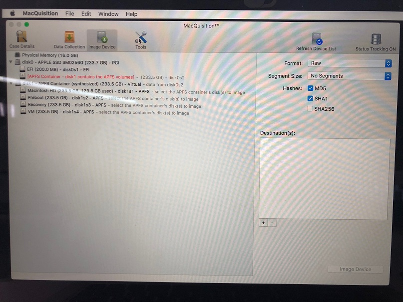

**To image the physical disk, select the disk0.**

**Do not select disk1.** If disk1 is selected for imaging, it will result with an image without mountable filesystems.

Disk 1 is only a container created by MacOS to hold the exhibit's data.

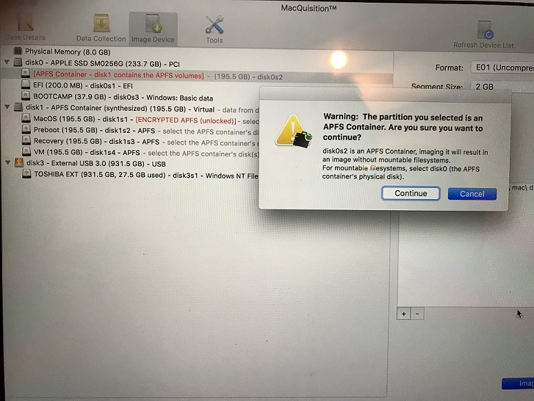

If content of disk 1 is selected for imaging, MacQuisition will infrom that the partition cannot be read.

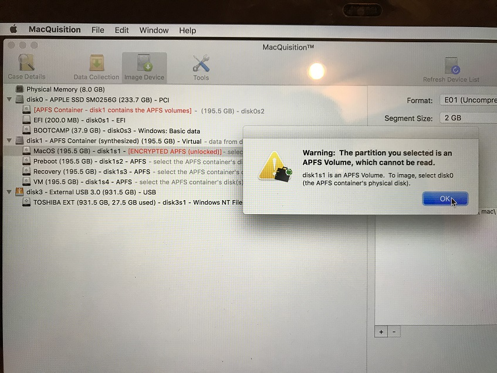

### 1.6.2 Image formats and settings

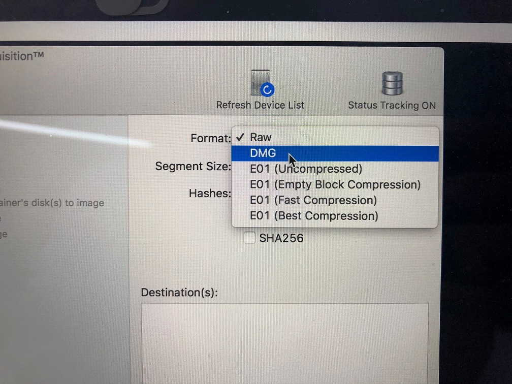

MacQuisiton provides several image formats.
- To create an evidence that could be mounted on another Mac, choose DNG
- To create an evidence that is to be processed in BlackLight, choose E01 (empty block compression)

Set segment size to 2GB and configure destination location. Imaging can begin afterwards.

### 2. Live acquistion

Live acquition can be achieved if the exhibit is logged on to the desired user's profile. Live acquisition can be done regardless of the activation of FileVault 2.

MacQuisiton will create an icon on the exhibit's desktop once MacQuisiton is inserted. Start the application and navigate to data collection tab to acquire items of interest. 

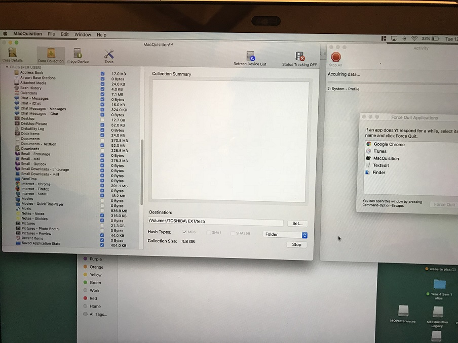

Live acquisiton is able to capture the live files, but **certain system and user files will fail in collection due to FileValut 2 protection**:

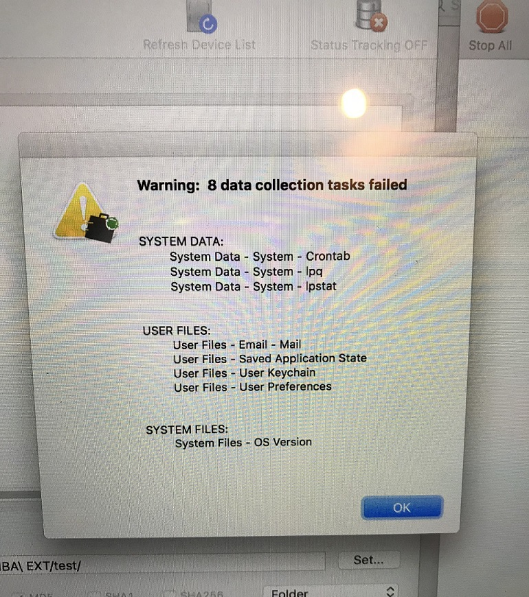

User Files
- Email - Native mail app
- Saved application state
- User Keychain
- User preference

System Files

- OS Version 
- Crontab (Scheduled jobs)
- Ipq (Unsure usage)
- Ipstat (Unsure usage)

## Analysis

This section provides a list of locations for analysis and the data to lookout for. Please note that items closed in [SquareParentheses] should be replaced.

### 1. System Information

- OS name and version
Plist describing the installed Operating System
```
/System/Library/CoreServices/SystemVersion.plist
```
- History of installed applications and updates
```
/Library/Receipts/InstallHistory.plist
```

- Software Update: Plist describing last attempt and last successful attempt at updating OS X software
```
/Library/Preferences/com.apple.SoftwareUpdate.plist
```
- Installation log
Install date of system, as well as date of system and software updates
```
/var/log/install.log
```
### 2. fsevents log

Location of fsevent

```
- Data: /private/var/.fseventsd
- System: /.fseventsd
```

**fsevent files are gzip files that has to be parsed** by tools such as BlackLight or the script below.
```
https://github.com/dlcowen/FSEventsParser
```

fsevent log is one of the most comprehensive logs for Mac analysis that archives the file system changes. However, as fsevent log is flushed into the log file periodically, exact timestamp is not available. 

Below is a list of flags (activites) that could be captured from fsevent log.

```
• Created
• Removed
• Modified
• Renamed
• Permissions
• Inode metadata
• Finder information
• Mount
• Unmount
• Last hard link removed
• End of transaction
• Document revisions
```
### 2.1 Useful grep searches for fsevent analysis

Below is a list of keywords that could be useful for grep searches. Combine with .* (AND) and other operators to filter further.
```
- Trash activity: 'Users/*/.Trash/*'
- User folders activity: 'Users/*/Documents/*’ OR 'Users/*/Downloads/*" OR 'Users/*/Desktop/*'
- Inrernet activity: 'Users/%/Library/Caches/Metadata/Safari/History/% OR 'Users/*/Library/ApplicationSupport/Google/Chrome/Default/Local Storage/*'
- Mount event: "mount"
- Terminal/Shell activity: "/.bash_history" OR any other shell history files
```

### 3. bash history and other shell history
- Terminal commands history
```
[UserAccount]/.bash_history
```
Mac supports other shells such as Zsh or Csh shell, look for other history files in the user's home directory 

### 4. iMessage

iMessage database will require SQLite to be pasred out. The database could be found at the location below:

```
Users/[UserAccount]/Library/Messages/chat.db
```


### 5. Outlook (Require DMG and Mac)

The outlook stoage is in olm. format. The items are not parsed by BlackLight. Below is the O365 storage location: 
```
/Users/[UserAccount]]/Library/Group Containers/UBF8T346G9.Office/Outlook/Outlook 15 Profiles/Main Profile/Messages
```
The profile can be replaced on another Mac. Restart outlook after the profile replacememnt. The desired user mailbox should be visible now. 

### 6. Apple System Log (ASL)

Apple System Log is a daemon that manages and stores system log information. ASL logs are binary, must view with syslog or console on Mac or using blackLight.

```
Private/var/log/asl ,also outputs to /var/log/system/log
```

### 7. Browser history

Browser history could be parsed out with BlackLight. Below are some of the useful locations for analysis should BlackLight is not available.

### 7.1 Safari
Plist listing files downloaded using Safari Browser
```
[UserAccount]/Library/Safari/Downloads.plist
```
Plist listing Safari web browsing history
```
[UserAccount]/Library/Safari/History.plist
```

### 7.2 Chrome

Location for Chrome browser artefacts

```
/Library/Application Support/Google/Chrome/Default. 
```

### 7.3 Firefox 

Location for Firefox browser artefacts

```
/Library/Application Support/Firefox/Profiles/
```


### 8. Installation log

It contains install date of system, as well as date of system and software updates
```
/var/log/install.log
```

### 9. SSH host file

SSH host file could be useful in identifying Virtual Private Server (VPS) services that might be accessed with the exhibit when cross exabined with the web cache. The host file could be located below
```
.ssh/known_hosts 
```
